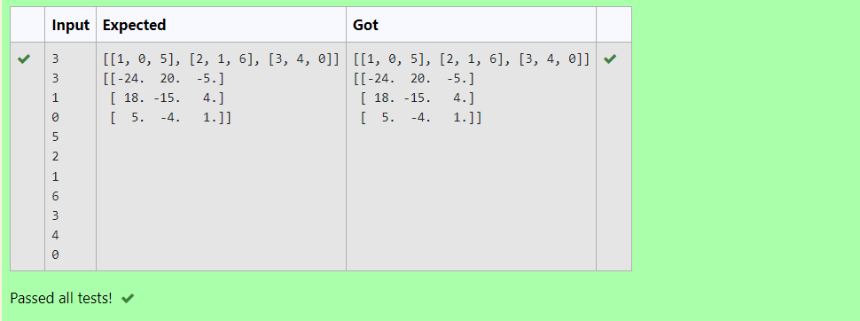

# INVERSE-OF-MATRIX

## AIM:
To write a python program to find the inverse of a nested array.

## ALGORITHM:
### Step 1:
Get the input from the user to know the dimensions of the array..
### Step 2:
Create empty list 1 and 2.
### Step 3:
Use iterations to append user input values into l1 and append l1 into l2.
Then empty l1.
### Step 4:
Import numpy module
### Step 5:
Use np.linalg.inv() function to find the inverse if the given array.


## PROGRAM:
```
Developed By:Rithiga Sri.B
Reference Number:21500732
n1,n2=int(input()),int(input())
l1,l2=[],[]
for i in range(n1):
    for j in range(n2):
        l1.append(int(input()))
    l2.append(l1)
    l1=[]
import numpy as np
print(l2)
B=np.linalg.inv(l2)
print(B)
```

## OUTPUT:

## RESULT:
Hence a python program is developed to find the inverse of a nested array.
